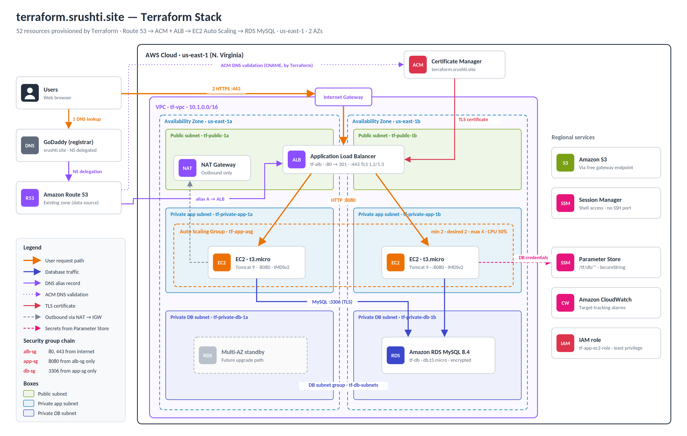

# Highly Available Web Application on AWS

A Java (JSP + MySQL) login and registration application deployed on a secure, highly available AWS architecture. The entire infrastructure (57 resources) is defined in **Terraform**: networking, security, database, secrets, IAM, compute, load balancing, DNS, TLS certificates and centralised log storage. Tomcat logs from every instance are shipped to Amazon S3 so they survive instance replacement.

| | |
|---|---|
| **Live application** | https://terraform.srushti.site |
| **Region** | us-east-1 (N. Virginia), two Availability Zones |
| **Author** | Srushti Jiyani |



---

## Contents

- [Architecture](#architecture)
- [Technology stack](#technology-stack)
- [Repository structure](#repository-structure)
- [Prerequisites](#prerequisites)
- [Deploying the infrastructure](#deploying-the-infrastructure)
- [Logging](#logging)
- [Verifying the deployment](#verifying-the-deployment)
- [Operations: update, roll back, tear down](#operations-update-roll-back-tear-down)
- [Security](#security)
- [Key design decisions](#key-design-decisions)
- [Cost](#cost)
- [Troubleshooting](#troubleshooting)
- [Known limitations and future improvements](#known-limitations-and-future-improvements)

---

## Architecture

**Request flow:** User → GoDaddy (registrar, NS delegated) → Amazon Route 53 → Application Load Balancer with an ACM certificate → EC2 instances in an Auto Scaling Group → Amazon RDS MySQL

**Logging flow:** every EC2 instance → `aws s3 sync` every 5 minutes (and once at shutdown) → S3 gateway endpoint → `s3://tf-tomcat-logs-<account-id>/tomcat/<instance-id>/` → deleted after 30 days

| Layer | What runs there |
|---|---|
| **Public subnets** (`10.1.1.0/24`, `10.1.2.0/24`) | Application Load Balancer, NAT Gateway |
| **Private app subnets** (`10.1.11.0/24`, `10.1.12.0/24`) | EC2 instances (Tomcat 9 on port 8080) in an Auto Scaling Group, 2–4 instances |
| **Private DB subnets** (`10.1.21.0/24`, `10.1.22.0/24`) | RDS MySQL 8.4, encrypted, no internet route |
| **Regional services** | Route 53, ACM, SSM Parameter Store, Session Manager, CloudWatch, IAM, and an S3 log bucket reached through a free gateway endpoint |

Security groups form a chain: **internet → `alb-sg` (80/443) → `app-sg` (8080 from ALB only) → `db-sg` (3306 from app only)**. No SSH port is open anywhere.

> The same architecture was first built manually in the AWS console (served at https://srushti.site, VPC `10.0.0.0/16`) to understand each component. This repository contains the Infrastructure-as-Code version, which runs side by side under the `tf-` prefix.

## Technology stack

| Area | Tools |
|---|---|
| Application | Java 17 (Amazon Corretto), JSP, Apache Tomcat 9, Maven, MySQL Connector/J 8.4 |
| Infrastructure | Terraform ≥ 1.5, AWS provider 6.x, random provider |
| AWS | VPC, EC2, Auto Scaling, ALB, RDS (MySQL 8.4), Route 53, ACM, S3, SSM Parameter Store and Session Manager, IAM, CloudWatch |
| DNS | GoDaddy (registrar) delegated to Route 53 |

## Repository structure

```
aws-ha-webapp/
├── db/
│   └── schema.sql            # idempotent schema, applied automatically at boot
├── docs/
│   └── architecture.png
├── src/main/webapp/          # JSP application (credentials read from environment)
├── terraform/
│   ├── providers.tf          # Terraform/provider versions, default tags
│   ├── variables.tf          # region, prefix, CIDRs, domain, repo
│   ├── network.tf            # VPC, 6 subnets, IGW, NAT, route tables, S3 endpoint
│   ├── security.tf           # chained security groups and rules
│   ├── database.tf           # random password, DB subnet group, RDS instance
│   ├── parameters.tf         # /tf/db/* settings in Parameter Store
│   ├── iam.tf                # EC2 role, least-privilege policy, instance profile
│   ├── alb.tf                # ALB, target group (port 8080), HTTP→HTTPS redirect
│   ├── compute.tf            # AMI lookup, launch template, ASG, scaling policy
│   ├── userdata.sh.tftpl     # instance bootstrap script (template)
│   ├── dns.tf                # ACM certificate, DNS validation, HTTPS listener, alias
│   ├── logs.tf               # Tomcat log bucket: private, encrypted, TLS-only, 30-day expiry
│   └── outputs.tf
├── pom.xml
└── README.md
```

## Prerequisites

- An AWS account and an IAM user (not root) with administrator access, configured with `aws configure`
- Terraform 1.5 or newer, the AWS CLI v2, and Git
- A public Route 53 hosted zone for the domain, with the registrar's nameservers pointing to it. Terraform **reads** this zone and never creates or deletes it.

## Deploying the infrastructure

```bash
git clone https://github.com/srush98/aws-ha-webapp.git
cd aws-ha-webapp/terraform

terraform init       # download providers
terraform fmt        # format
terraform validate   # check syntax
terraform plan       # review: 57 resources to add on a fresh account
terraform apply      # about 15 minutes (RDS is the slowest)
terraform output     # app_url, alb_dns_name, db_endpoint, log_bucket, ...
```

After `apply`, the instances need about 5 minutes to bootstrap before the target group reports them healthy. Then open the `app_url` output.

To use another domain or account, change the defaults in `variables.tf` (`domain_name`, `subdomain`, `repo_url`).

### How an instance bootstraps

`userdata.sh.tftpl` runs once at first boot:

1. Installs Amazon Corretto 17, Git and the MariaDB client, and installs Tomcat 9 under an unprivileged `tomcat` user.
2. Clones this repository and builds the WAR with Maven, deploying it as `ROOT.war` so the app is served at `/`.
3. Reads the database URL, user and password from Parameter Store into `/etc/tomcat-db.env` (mode 640). The password is never stored in user data or in code.
4. Applies `db/schema.sql` (`CREATE TABLE IF NOT EXISTS`), so a fresh stack needs no manual SQL.
5. Starts Tomcat as a systemd service.
6. Installs a systemd timer that ships `/opt/tomcat/logs` to S3 every 5 minutes, plus a shutdown hook that uploads once more when the instance stops.

## Logging

Tomcat logs are stored centrally in S3 because Auto Scaling instances are disposable: self-healing, scale-in and instance refresh all delete an instance's disk.

| Item | Detail |
|---|---|
| **Bucket** | `tf-tomcat-logs-<account-id>` (`terraform output log_bucket`) |
| **Layout** | `tomcat/<instance-id>/catalina.out`, `catalina.<date>.log`, `localhost.<date>.log`, `localhost_access_log.<date>.txt` |
| **Frequency** | Every 5 minutes (systemd timer `tomcat-logs.timer`), plus a final upload at shutdown (`tomcat-logs-final.service`) |
| **Retention** | Lifecycle rule `expire-tomcat-logs-30d` deletes logs after 30 days |
| **Protection** | Public access blocked, SSE-S3 encryption, bucket policy denies non-TLS requests |
| **Instance access** | Write-only: `s3:PutObject` and `s3:ListBucket` under `tomcat/` only; instances cannot read or delete logs |

The shutdown hook is ordered `Before=tomcat.service`, so during shutdown Tomcat stops first (flushing its logs) and the upload runs before the network goes down.

**Forcing an upload** (on an instance, through Session Manager):

```bash
systemctl list-timers tomcat-logs.timer --no-pager
sudo systemctl start tomcat-logs.service
sudo journalctl -u tomcat-logs.service -n 5 --no-pager
```

## Verifying the deployment

```bash
# HTTPS and redirect
curl -sI http://terraform.srushti.site | head -3    # 301 → https://terraform.srushti.site:443/
curl -sI https://terraform.srushti.site | head -1   # HTTP/1.1 200

# Infrastructure matches the code
terraform plan                                      # "No changes."

# Database is private and available
aws rds describe-db-instances --db-instance-identifier tf-db \
  --query "DBInstances[0].[DBInstanceStatus,PubliclyAccessible]"
```

From an instance (EC2 → Connect → **Session Manager**), prove encrypted database connectivity without printing the password:

```bash
MYSQL_PWD=$(aws ssm get-parameter --region us-east-1 --name /tf/db/password \
  --with-decryption --query Parameter.Value --output text) \
  mysql -h <db_endpoint> -u admin --ssl jwt -e "SHOW TABLES; SHOW STATUS LIKE 'Ssl_cipher';"
```

**High-availability test:** terminate one instance in the EC2 console. The ASG launches a replacement automatically and the site stays up throughout. The terminated instance's `tomcat/<instance-id>/` folder remains in S3 with its final log lines.

**Write-only check:** from an instance, `aws s3 rm s3://<log_bucket>/tomcat/ --recursive` must fail with **AccessDenied**.

## Operations: update, roll back, tear down

**Update the application:** push the change to `main`, then roll it out with zero downtime. New instances clone the latest code at boot, pass their health checks, and replace the old ones one at a time while at least 100% of capacity stays healthy:

```bash
aws autoscaling start-instance-refresh --auto-scaling-group-name tf-app-asg
```

Watch progress in *EC2 → Auto Scaling groups → tf-app-asg → Instance refresh*. Changes to the launch template in Terraform (for example the bootstrap script) trigger the same rolling refresh automatically on `terraform apply`.

**Roll back:** revert the commit, push, and start another instance refresh.

```bash
git revert HEAD && git push
aws autoscaling start-instance-refresh --auto-scaling-group-name tf-app-asg
```

**Tear down:**

```bash
cd terraform && terraform destroy
```

This removes every Terraform-managed resource, including the database (no final snapshot), the Tomcat log bucket and its contents (`force_destroy`), and the `terraform.srushti.site` record and certificate. The Route 53 hosted zone is only read by Terraform, so it is **not** deleted and the domain delegation stays intact.

## Security

- **Network isolation:** application and database servers live in private subnets with no public IPs; the database subnets have no route to the internet.
- **Least-privilege security groups:** each tier accepts traffic only from the tier in front of it; outbound traffic from the app and database tiers is restricted.
- **No SSH:** administrative access is through SSM Session Manager (IAM-controlled and logged).
- **Secrets:** the database password is generated by Terraform (`random_password`), stored as a KMS-encrypted SecureString, and read only at boot by the instance role. It never appears in code, user data or logs.
- **Encryption:** HTTPS with TLS 1.2/1.3 at the ALB (ACM certificate); TLS between the application and MySQL (`sslMode=REQUIRED`); RDS storage encrypted with KMS; log bucket encrypted with SSE-S3.
- **Tamper-resistant logging:** instances have write-only access to the log bucket, which is private and accepts TLS requests only, so a compromised server cannot read or delete past logs.
- **IMDSv2 required** on all instances, protecting instance credentials from SSRF-style attacks.
- **Application fixes:** SQL injection removed with `PreparedStatement`, and hard-coded credentials removed.
- **Terraform state contains secrets** (the generated password), so it is excluded from Git by `.gitignore` and backed up privately.

## Key design decisions

| Decision | Choice | Why | Alternative considered |
|---|---|---|---|
| IaC tool | Terraform | Multi-provider, readable `plan` previews, widely used | CloudFormation (AWS-only, manages its own state) |
| Load balancer | ALB | Layer 7: HTTP health checks, stickiness, redirects, ACM | NLB (Layer 4), Classic LB (legacy) |
| Database | RDS MySQL 8.4 | Managed backups, patching, encryption | MySQL on EC2 |
| Outbound access | One NAT Gateway | Half the cost of one per AZ; inbound traffic unaffected by its failure | NAT per AZ |
| Server access | Session Manager | No open ports or keys | Bastion host with SSH |
| Logging | Tomcat logs to S3 every 5 min | Logs survive instance replacement; no agent; free upload path through the gateway endpoint; 30-day expiry | CloudWatch agent and CloudWatch Logs (real-time and searchable, more setup) |
| Updates | Rolling instance refresh | Fresh servers from the launch template; same path as scaling and self-healing; no drift | Patching servers in place (servers drift apart) |
| Health check | Shallow (`/`) | Avoids taking every server out during a database blip | Deep check that queries the database |
| DNS zone | Terraform `data` source | Terraform cannot accidentally delete or recreate the zone | Terraform-managed zone (nameservers would change) |

## Cost

Approximately **$3–4 per day** while running (NAT Gateway about $1, ALB about $0.55, two t3.micro instances, db.t3.micro, public IPv4 addresses, and a Route 53 hosted zone at $0.50/month). ACM certificates, IAM, the S3 gateway endpoint and Session Manager are free, and storing a few MB of logs for 30 days costs fractions of a cent. Run `terraform destroy` when the environment is not needed.

## Troubleshooting

| Symptom | Likely cause | Fix |
|---|---|---|
| Targets unhealthy for more than 6 minutes | Bootstrap failed | Session Manager → `sudo tail -n 30 /var/log/cloud-init-output.log` |
| Targets unhealthy with "Request timed out" | Wrong target port or security group | Target group must use port 8080; `app-sg` must allow 8080 from `alb-sg` |
| `InsufficientDBInstanceCapacity` during apply | Temporary AWS capacity shortage for that instance type | Use an equivalent class (e.g. `db.t3.micro`) or retry later; Terraform resumes where it stopped |
| `InstanceRefreshInProgress` | A refresh is already running | Wait for it to finish, then start a new one |
| Log upload fails with AccessDenied | `s3:ListBucket` missing (`sync` lists the destination before uploading) | Check the `tf-app-policy` statements in `iam.tf` |
| No logs in the bucket yet | The first upload runs 5 minutes after boot | Wait, or run `sudo systemctl start tomcat-logs.service` on the instance |
| Parameter names wrong when created from Git Bash | Git Bash converts `/path` arguments to Windows paths | Use PowerShell, or prefix the command with `MSYS_NO_PATHCONV=1` |

## Known limitations and future improvements

- **Remote state:** move Terraform state to an encrypted, versioned S3 backend with locking for team use.
- **Database HA:** enable RDS Multi-AZ; add a NAT Gateway per AZ.
- **Stateless sessions:** store sessions in ElastiCache or the database to remove the need for ALB stickiness.
- **Password hashing:** the application stores user passwords in plain text; hash them (e.g. bcrypt).
- **Faster scale-out:** ship a pre-built WAR or a golden AMI so new instances do not compile the app at boot.
- **Edge security:** add AWS WAF to the ALB.
- **Logging:** an ASG lifecycle hook to guarantee the final log upload; CloudWatch Logs for real-time search; S3 versioning or Object Lock to make logs tamper-proof.
